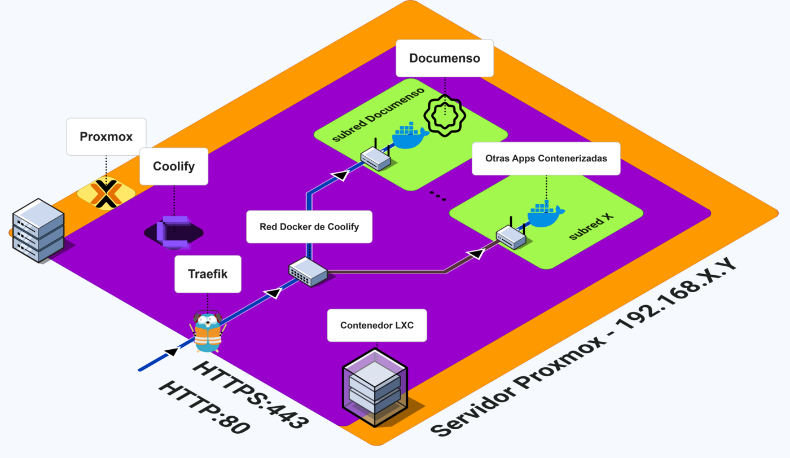
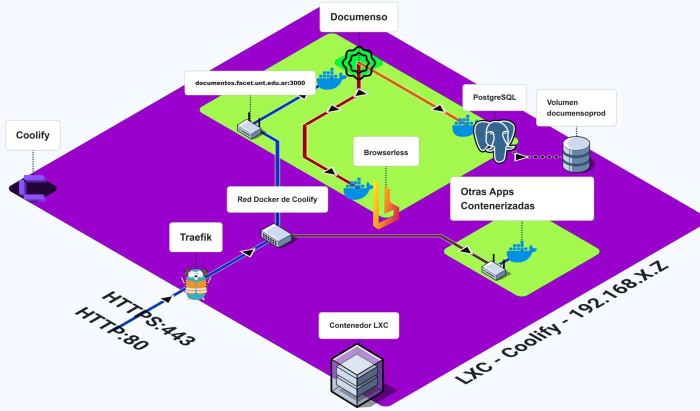
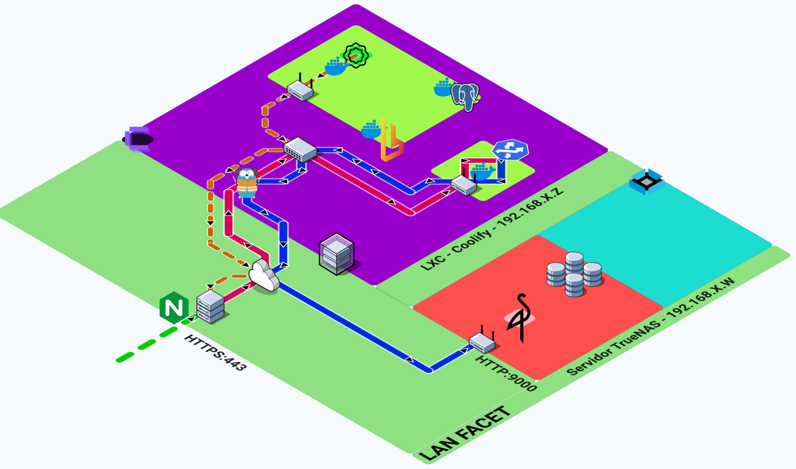
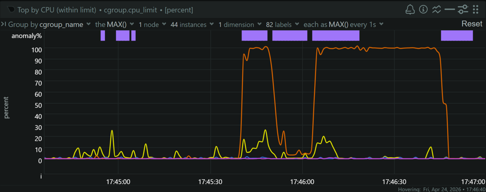
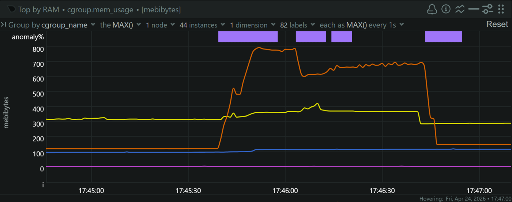

For my graduation thesis in Computer Engineering, I designed, implemented and deployed an on-premise electronic document signing system for FACET — the Faculty of Exact Sciences and Technology at the National University of Tucumán (UNT). This post tells the full story: the problem that motivated the work, the objectives, how I selected and deployed the platform, and what I learned running it in production.

Here are the slides from my thesis defense — use the arrow keys to navigate. If you want to watch the full defense, the live stream is recorded on [YouTube](https://www.youtube.com/watch?v=Vhdi6vNXI-Q).

<iframe
  src="/presentacion/index.en.html"
  title="Thesis defense presentation — Electronic Document Signing System for FACET"
  class="w-full aspect-video rounded-lg border border-gray-700"
  allowfullscreen
  loading="lazy"
></iframe>

## Context and Problem

FACET processes a constant volume of administrative and academic documentation that requires validation and signatures from its authorities and teaching staff. Historically, the signing workflow was manual and decentralized, and it looked like this: a user needs a document signed, downloads the PDF, signs it with an external web tool, saves a copy, opens the email client, attaches the file and sends it to the next person in the chain. The cycle repeats for every signer until the document is complete.

That loop produces four structural problems:

- **Administrative time.** Signers spend their time on repetitive tasks — downloading, looking for an external signing tool, processing the file, sending it again — instead of acting immediately and centrally.
- **Human errors.** Email threads get lost, attachments get forgotten, and without a clear visual guide in the document, people sign in the wrong place.
- **No traceability.** Every signer holds an intermediate version of the document on their own device. There is no central record of who signed or when, and nothing enforces the sequential order of signatures, so nobody can tell exactly where a procedure stands.
- **Inefficient storage.** With no single repository, the same file is replicated across dozens of computers and mail servers, wasting space everywhere.

## Work Objectives

The general objective of the thesis was to design, implement and deploy a "turnkey" solution for managing and electronically signing PDF documents at the faculty, including the infrastructure and procedures needed for its operation and maintenance.

The proposal replaces the seven-step manual loop with an automated flow in four steps:

1. **Single upload.** The user — a lecturer, student or staff member — uploads the PDF to the system once.
2. **Visual configuration.** Directly in the web interface, the sender defines who must sign and where each signature goes on the document.
3. **Automation engine.** The platform takes over from there: it notifies each signer in turn and manages the flow without manual intervention.
4. **Traceable output.** The final document is signed with a cryptographic seal, verifiable by anyone, and stored in the faculty's own infrastructure.

Four specific objectives guided the work:

1. **Survey and selection.** Evaluate open-source alternatives through a comparative study and choose the solution that best fits the faculty's organization and its institutional identity and storage services.
2. **Architecture and policies.** Design the deployment architecture, configure the virtualization, network and storage infrastructure, and define backup and retention policies.
3. **Pilot implementation.** Validate the solution with real users, ensuring the tool responds correctly to the proposed workflow.
4. **Documentation and transfer.** Produce the maintenance manual and the procedures that guarantee knowledge transfer and service continuity.

## State of the Art and Platform Selection

The first step was to survey the market. The leading commercial platforms — DocuSign, Dropbox Sign and Adobe Sign — sell per-user subscriptions that start at $24–25 USD per user per month, with yearly sending limits (100 envelopes per user for DocuSign, 150 for Adobe Sign). For just 20 users, the cheapest option — Adobe Sign — would cost $480 USD per month, around $5,760 USD per year.

That math does not work for a public university in Argentina. And the faculty already had the technical resources — servers, storage, network — to run an open-source solution itself. An important note: with an on-premise solution, the institution itself must guarantee service availability and the security of its data and service — responsibilities that in a SaaS are delegated to the provider through an SLA (Service Level Agreement).

That left two mature open-source candidates, both distributed under AGPL-3.0 and both self-hostable: <a href="https://github.com/documenso/documenso" target="_blank" rel="noopener noreferrer"><strong>Documenso</strong></a> (TypeScript, Remix + Prisma, PostgreSQL) and <a href="https://github.com/docusealco/docuseal" target="_blank" rel="noopener noreferrer"><strong>DocuSeal</strong></a> (Ruby on Rails + Vue.js, PostgreSQL). After testing both systems locally, I reached the following conclusions:

| Feature                  | Documenso (Community) | DocuSeal (Community)             |
| ------------------------ | --------------------- | -------------------------------- |
| Role-based access (RBAC) | Included              | Locked behind Enterprise edition |
| Google login (SSO)       | Included              | Locked behind Enterprise edition |
| Custom branding          | Included              | Locked behind Enterprise edition |
| License                  | AGPL-3.0              | AGPL-3.0                         |

Without RBAC, every user created in DocuSeal's community edition gets administrator privileges by default — a security problem that makes it unviable in a multi-user institutional environment. Documenso, in contrast, ships all three features out of the box.

Beyond the feature matrix, Documenso won for three reasons that map directly to the faculty's needs:

- **Identity.** Native Google OAuth integration that ties the platform to the faculty's Google Workspace: only users with an institutional `@herrera.unt.edu.ar` account can sign in, with no need to manage a second credential store.
- **Organizational model.** Documenso's organizations and teams map almost exactly onto FACET's structure: the faculty is the root organization, each department (DEEC, Physics, Mathematics) becomes a team with its own isolated document space, and a lecturer who teaches in two departments simply belongs to both teams.
- **Infrastructure ecosystem.** Native compatibility with S3-compatible object storage (MinIO) and SMTP relay services for email notifications.

## Infrastructure and Deployment Architecture

The deployment is organized in three layers, and every request from the internet crosses all of them:

**Edge layer.** The faculty's perimeter Nginx reverse proxy terminates SSL with Let's Encrypt certificates for `*.facet.unt.edu.ar` and forwards traffic to the internal network. Neither the server's IP nor Docker's internal ports are ever exposed directly to the internet.

**PaaS layer.** <a href="https://coolify.io/" target="_blank" rel="noopener noreferrer"><strong>Coolify</strong></a> runs inside an LXC container on Proxmox VE. The container (Ubuntu 22.04) was already provisioned by the faculty's systems area: 8 vCPUs, 8 GiB of RAM, 50 GB root disk plus a 160 GB mount. Coolify lets us manage environment variables, review system logs, handle backups and check container status, plus dynamic per-domain routing through Traefik — all from a web interface.

**Service layer.** Four Docker containers on the internal network:

| Container   | Image                        | Purpose                              |
| ----------- | ---------------------------- | ------------------------------------ |
| documenso   | `documenso/documenso:v2.1.0` | E-signature application              |
| postgres    | `postgres:17`                | Primary database                     |
| browserless | `browserless/chrome`         | Headless Chromium for PDF generation |
| socat       | `alpine/socat`               | TCP bridge to physical MinIO storage |





Neither Coolify's template nor the Docker Compose guide in Documenso's documentation resolved the institutional environment on its own. The final configuration came from combining both references with problems discovered during testing — the four decisions below are the ones that actually took time.

### Browserless

After completing the first end-to-end signing cycle, documents stayed stuck in `PENDING` state. The signing flow worked, but the final PDF with the embedded certificate was never generated.

Going through the logs, I found the error:

```
internal.seal-document job failed:
Executable doesn't exist at /home/nodejs/.cache/ms-playwright/chromium_headless_shell
```

Documenso's Docker image does not include Chromium. But the signing certificate PDF generation depends on Playwright, which needs a headless browser to render the certificate page into a PDF overlay. The code takes two paths: if `NEXT_PRIVATE_BROWSERLESS_URL` is set, rendering is delegated to an external instance over WebSocket; otherwise it tries a local Chromium install that does not exist in the official image.

This is not documented in the official setup guide. I found it through the community Discord and GitHub issues [#2060](https://github.com/documenso/documenso/issues/2060) and [#1634](https://github.com/documenso/documenso/issues/1634).

The fix is to deploy `browserless/chrome` as an auxiliary service and connect it via WebSocket:

```yaml
browserless:
  image: browserless/chrome:1.61-chrome-stable
  restart: always
  deploy:
    resources:
      limits:
        cpus: "2"
        memory: 2g
  environment:
    MAX_CONCURRENT_SESSIONS: 5
    MAX_QUEUE_LENGTH: 20
    TIMEOUT: 60000
  extra_hosts:
    - "documentos.facet.unt.edu.ar:host-gateway"
```

Then in Documenso's environment:

```text
NEXT_PRIVATE_BROWSERLESS_URL=ws://browserless:3000
```

Resource limits matter. Five concurrent Chrome sessions consume a peak of roughly 1.3 GB — a 30% margin inside the container's 2 GB limit. Without `MAX_CONCURRENT_SESSIONS=5`, a burst of simultaneous signing requests can exhaust the memory and cause the kernel to kill the container — OOM, out of memory.

### Socat proxy: bridging Docker to physical storage

Documenso centralizes its S3-compatible object storage configuration in a single environment variable:

```text
NEXT_PRIVATE_UPLOAD_ENDPOINT=https://minio.facet.unt.edu.ar
```

Here is the problem: both the browser (for branding images like logos) and the backend (for signed PDFs) must reach the same URL. But the MinIO server lives on a physical TrueNAS box outside Docker's virtual network. The solution was to publish a single unified public domain, `minio.facet.unt.edu.ar`, and make every path to storage cross the perimeter proxy.

Two flows converge on that domain. The first is direct: Documenso generates pre-signed URLs that the browser consumes straight from MinIO for the branding images (logos, for instance). That flow required authorizing the institutional origin `https://documentos.facet.unt.edu.ar` in MinIO's CORS policy — without it, the browser blocks those requests and the images never load. The second is indirect: for PDFs, the browser talks only to Documenso's API, and the backend performs the S3 operations itself.

A Socat container makes the physical MinIO reachable inside Docker's network: it listens on port 9000 and forwards all TCP traffic to the TrueNAS server:

```yaml
socat:
  image: alpine/socat
  restart: unless-stopped
  command: "TCP4-LISTEN:9000,fork,reuseaddr TCP4:TRUENAS_IP:9000"
```

Inside Docker, Traefik routes `minio.facet.unt.edu.ar` to the Socat container's port 9000. And that is Socat's whole job: it forwards the TCP traffic as it arrives, to port 9000 of the real MinIO server on TrueNAS. Since the browser and the backend use the same public domain, both end up talking to the same MinIO instance. I deployed it as an independent project in Coolify, so the tunnel stays reusable for future faculty services.



One additional configuration detail caused a real problem: `client_max_body_size` on Nginx. During initial tests, any upload over 1 MB was rejected with `413 Content Too Large` — the effective limit was imposed by the edge proxy, not by Documenso. The fix was 50 MB for the Documenso app and 75 MB for the MinIO path, because signed PDFs are heavier than the originals: the embedded certificate and the users' signature images add size, and the MinIO path limit applies to the final file, not the upload.

### Pinned version: update problems

Documenso v2.2.0 and later require AVX/AVX2 CPU instructions. The dependency chain is: Documenso uses Sharp for image processing, Sharp bundles libvips, and recent libvips builds are compiled with AVX SIMD optimizations.

The faculty's server runs a Xeon E5620. That is a Westmere-EP processor from 2010. It does not support AVX.

I verified this on the host:

```bash
lscpu | grep -i avx
# (empty output)
```

When I tried to upgrade to v2.2.0 or newer, the Documenso service died returning a 500 error. Going through the logs, I found the container terminating with `Illegal instruction (core dumped)` — Sharp's native module tried to execute an AVX instruction the CPU does not implement. From there I checked the community Discord and GitHub issues for similar problems, and found the restriction documented in issue [#2292](https://github.com/documenso/documenso/issues/2292).

The consequence: Documenso is pinned at v2.1.0. This is documented as technical debt: the hardware migration that unlocks Documenso updates is a separate project.

### Authentication: Google OAuth restricted to one domain

Internal users authenticate through Google OAuth 2.0, restricted to the `@herrera.unt.edu.ar` domain. The OAuth app is registered as _Internal_ in Google Cloud Console, and local signup is disabled:

```text
NEXT_PUBLIC_DISABLE_SIGNUP=true
```

The restriction is enforced at two levels. When someone tries to log in with a non-institutional Google account, Google's authorization layer returns `403: org_internal` before they ever reach Documenso — the block happens at the identity provider, not the application. And the signup restriction works server-side too: a direct request to `/signup` gets a `302` redirect to `/signin` from the backend.

External signers (document recipients) can have any email domain. They do not need accounts. They access documents through unique, time-limited signing links sent by email.

### Cryptographic signing: self-signed certificate

Documenso applies a digital signature to each PDF. The signature is applied at platform level: each signer's actions — strokes, text, checkboxes — are recorded in the system, and once everyone has completed their intervention, the document is cryptographically sealed under the instance's institutional certificate. That seal provides two guarantees: integrity (any modification after signing invalidates the signature) and authenticity (the PDF was signed by the certificate holder).

The certificate is a PKCS#12 container injected as a Base64-encoded environment variable, not mounted as a file:

```text
NEXT_PRIVATE_SIGNING_TRANSPORT=local
NEXT_PRIVATE_SIGNING_LOCAL_FILE_CONTENTS=<base64-encoded-p12>
NEXT_PRIVATE_SIGNING_PASSPHRASE=<passphrase>
```

I generated the institutional certificate with OpenSSL:

```bash
openssl genrsa -out private.key 2048
openssl req -new -x509 -key private.key -out certificate.crt -days 3650 \
  -subj "/C=AR/ST=Tucuman/L=San Miguel de Tucuman/O=Universidad Nacional de Tucuman/OU=FACET/CN=documentos.facet.unt.edu.ar"
openssl pkcs12 -export -legacy -out certificate_facet.p12 \
  -inkey private.key -in certificate.crt
```

RSA 2048-bit, X.509 self-signed, 10-year validity (March 2026 to March 2036).

Under Argentine Law 25.506, this qualifies as an "electronic signature," not a "digital signature." The distinction is legal, not technical: Article 2 defines the digital signature as a mathematical procedure that uniquely identifies the signer and detects any alteration, which the platform fulfills, but Article 9 requires the certificate to be issued by a Certification Authority licensed by the State. Ours is self-signed, generated inside the institution. That makes the system's output an electronic signature — fully valid for internal administrative use at FACET. Adobe Acrobat shows "validity unknown" when opening signed documents, which is expected for a self-signed certificate; it does confirm document integrity.

### Storage sizing

I did not assign the MinIO quota by eye. The calculation starts from the real operational ceiling of the email provider: Brevo's free tier allows 300 transactional emails per day. A typical procedure consumes 6 notifications (invitations plus the completion notice, averaging five signers), which caps the platform at 50 documents per day. Each procedure generates two PDFs of ~10 MB — the original and the signed version — so the maximum data growth is 1 GB per day.

With a 5-year ILM retention policy (1,825 days) — a timeframe that seemed reasonable for keeping documents on file — that projects to 1.825 TB. I assigned a strict 2 TB quota — about 10% of safety margin — which represents just 11% of the 18.19 TiB exposed by the faculty's TrueNAS storage. The storage is not the constraint; the sending limit of the free email plan is.

### Backup strategy

Running on-premise means the faculty owns continuity entirely. I organized preservation in three domains with different retention requirements:

**PostgreSQL.** Daily `pg_dump` at 3:00 AM via Coolify's backup job, stored in the `documenso-backup-databases` bucket with a 5 GB quota. 30-day ILM retention with Object Lock in governance mode — nobody can delete or modify the dumps during that window, not even the root user. RPO of 24 hours. Restoration runs from the Coolify UI (`pg_restore --clean`) — during validation I ran a full restore drill to prove it works.

**Documents.** The `documenso-prod` bucket holds originals and signed versions, with the same 1,825-day retention, Object Lock in governance mode and a 2 TB quota. Object Lock forces bucket versioning, and the ILM rules clean up the leftovers that deletions leave behind — without that cleanup, the quotas would eventually fill with dead files.

**Configuration.** A bash script runs daily at 4:00 AM (one hour after the database dump), packages the `docker-compose.yml` files — including the signing certificate `.p12` — and ships the tarball to the `backups-coolify` bucket via `rclone`. 180-day retention, 100 MB quota. Restoring the environment from a backup takes minutes; recreating it from scratch takes hours. If the certificate is lost, a new one can be generated; the backup exists to keep the same certificate if something happens to the Coolify server.

### Performance results

The entire stack runs inside the LXC container with 8 vCPUs and 8 GiB of RAM. I measured consumption per container with Netdata, in normal operation and under a controlled load burst.

**Baseline** (idle, no active signing): the whole stack uses approximately 397 MiB of RAM — about 5% of the allocation — split between Documenso (~215 MiB), Browserless (~102 MiB), PostgreSQL (~77 MiB) and the Socat proxy (~2 MiB). CPU usage is near zero, with occasional page-render peaks.

**Peak load** (5 concurrent document signing operations): the burst window lasted about 1 minute 12 seconds. Browserless processes the seal jobs sequentially, which shows as a stepped RAM curve — each step is a Chrome process starting. It peaked at 797 MiB of RAM and 100% of one vCPU (12.5% of the 8 vCPUs), and the whole stack hit 1,338 MiB — 16.3% of the LXC's memory.





Even in the worst case, the stack consumed 16.3% of available RAM, leaving about 6.7 GiB free.

## Live Demonstration

The system is live at [documentos.facet.unt.edu.ar](https://documentos.facet.unt.edu.ar). You can check its health endpoint at `/api/health`, which reports the status of the database and the signing certificate.

I ran a live demo of the system during my thesis defense — you can watch it on [YouTube](https://www.youtube.com/watch?v=Vhdi6vNXI-Q&t=1070), starting at minute 17:50.

## Conclusions

The deployment consolidated a functional electronic signing system on institutional infrastructure: Documenso as the application core, PostgreSQL for transactional persistence, Browserless for certificate rendering, MinIO for object storage, and the Socat proxy forwarding traffic to the physical storage server, all orchestrated by Coolify and Traefik in an LXC container on Proxmox. It is one of the first production services deployed entirely on the DEEC's infrastructure, and it eliminated the recurring licensing cost.

The validation work — healthchecks, end-to-end signing cycles, a restore drill, and load measurements — confirmed the system meets its functional, security, performance and continuity objectives. And the manuals and procedures documented in the thesis mean the service does not depend on me: it survives its builder. That is the real test of any production deployment.

If I have to keep one thing from this work, it is what I learned. It gave me the chance to operate with real compute resources — my faculty's own servers — and to solve a concrete problem of my faculty using an open-source tool. It taught me the whole deployment process of a system: how fundamental logs are for diagnosing problems, Netdata metrics for observability and traceability, and backups with their retention policies as a core part of the design, not an afterthought. The project has a lot of room to improve and scale — resilience is the biggest debt — but it gave me system design foundations that I apply in every new project.

### What I would do differently

**TrueNAS is a single point of failure.** All signed documents live on one physical server with no off-site replication. A catastrophic NAS failure or a corrupted pool would mean losing the PDFs. The next step is MinIO cross-site replication to a second location or a cloud-compatible destination.

**Single compute node.** The Proxmox host is one machine. If it goes down, everything goes down. Docker Swarm or K3s across multiple nodes would provide high availability, but that is a larger infrastructure project.

**Hardware migration is blocking updates.** The Xeon E5620 pins Documenso at v2.1.0: until the hardware supports AVX, we cannot get security patches or new features. It is the most urgent pending item.

**Self-signed to licensed CA.** If the faculty ever wants to move from an electronic signature to a digital signature, it only takes swapping the certificate for one from a licensed CA under Argentina's national PKI — the platform supports it natively.
